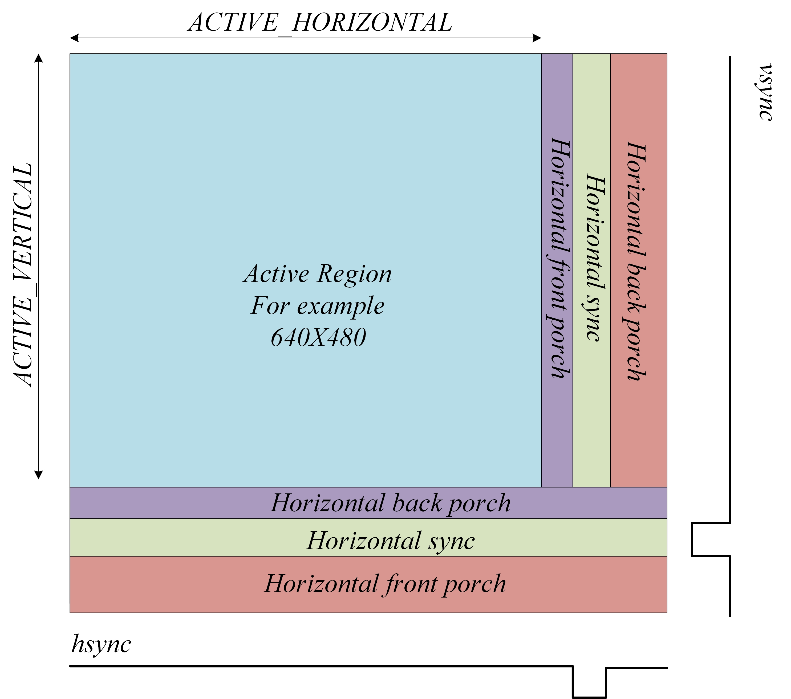
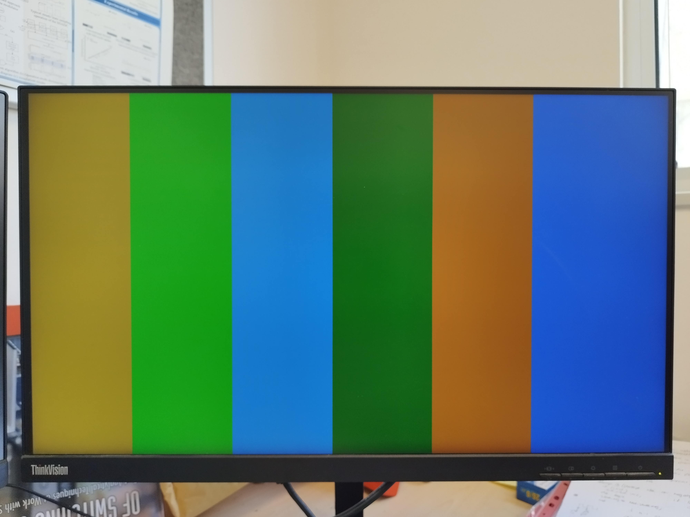
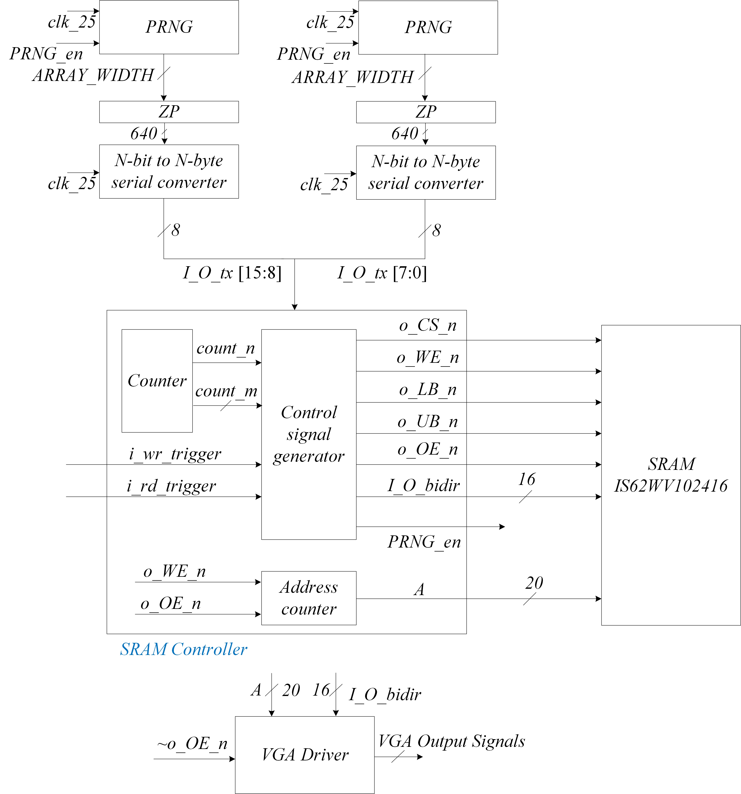
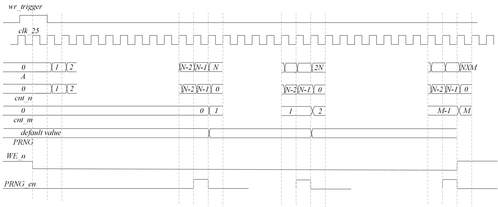
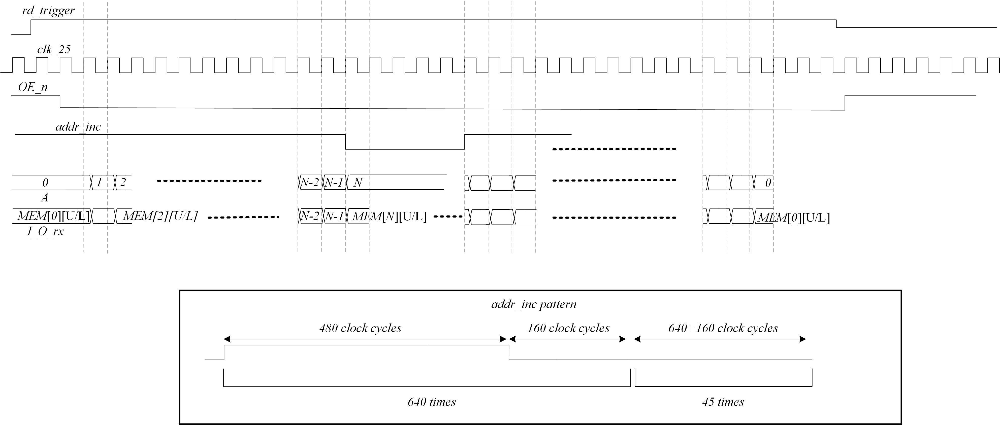
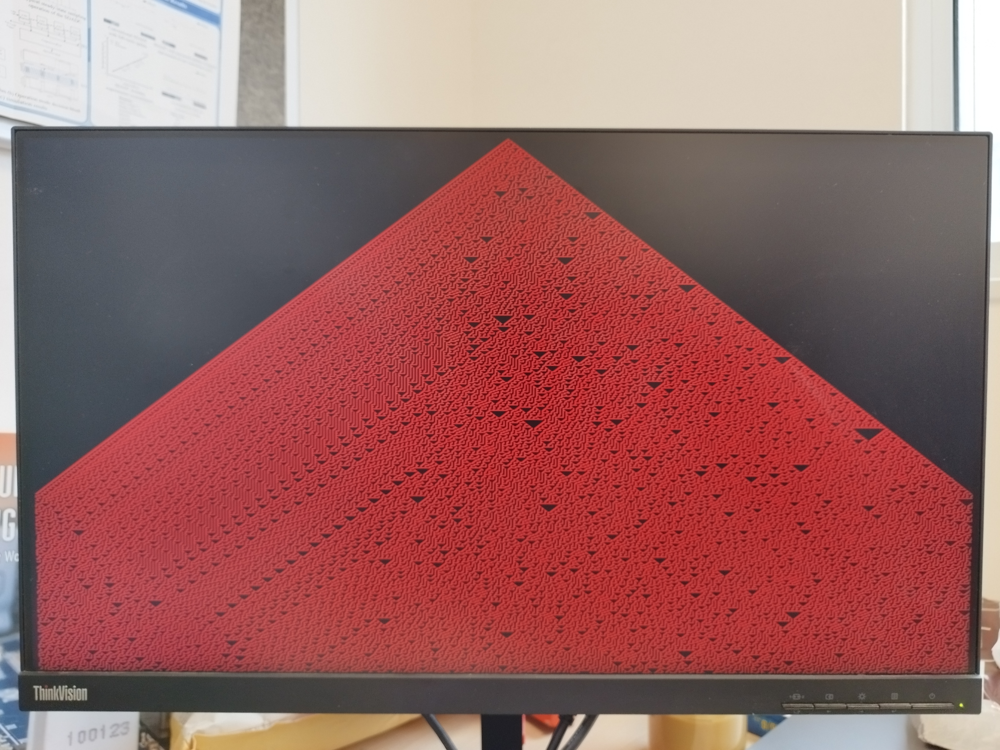

# Cellular-automaton-based sequence generation and visualization 

> SystemVerilog CA-based number generation and visualization    

This repository includes source files in SystemVerilog of the required sub-modules for generating pseudo-random numbers by cellular-automaton, storing them on an external SRAM IC and visualizaing them on a monitor via a VGA controller. Altera DE-115 development board is used here for practical verification since it has both VGA connector and an external SRAM IC (IS61WV102416BLL).

## VGA Driver
To drive a [VGA](https://en.wikipedia.org/wiki/Video_Graphics_Array) screen, you need to manipulate two digital synchronization pins, HSYNC and VSYNC, and three analog color pins, namely RED, GREEN, and BLUE. The HSYNC pin informs the screen about moving to the next row of pixels, while the VSYNC pin signals the start of a new frame.
Here,VGA 640X480@60 Hz industry standard is used which indicates pixel clock of 25.175MHz. Timing information and row/colomn segmentation to different time intervals can be found in the following [link](http://tinyvga.com/vga-timing). An illustrative figure indicating these sections is attached:

 

The source files are located at the repository root:
- [VGA Driver](./VGA_Driver.sv)
- [VGA Driver Verification](./High_arch_VGA_verification.sv)

Verification is carried by continiously trasmitting constant horizontal data, resulting in vertical color pattern as shown in the attached picture. Please refer to the DE-115 user manual for FPGA-VGA pin locations. 

 

## CA-PRNGs, SRAM and VGA controller integration
A conceptual block diagram of the overall system is shown below. It comprises:
1. Two instantiations of PRNG modules. Please refer to the dedicted [repository](https://github.com/tom-urkin/PRNG) for for information.
2. Two instantiations of N-bit to N-byte converters with zero-pedding to comply with required frame width (640). This module produces 640 8-bit words on the coarse of 640 cycles.
3. SRAM controller that generated the required control signals which synchronize between the CA-based sequence generation and writing/reading operations
4. VGA driver to visualize the patterns on a monitor

 
 
### Timing diagrams
Timing diagrams for write and read operations are added here to improve understading of the system's internal signals.
 

 

## Demonstration
Demonstration of 'Rule 30' in red and 'Rule 126' in red. Exploration of other patterns, i.e. different rules, can be easily done via the 'RULE' parameter in the PRNG modules.

 

demonstration of rule '30':
 

demonstration of rule '126':
 

## Support

I will be happy to answer any questions.  
Approach me here using GitHub Issues or at tom.urkin@gmail.com